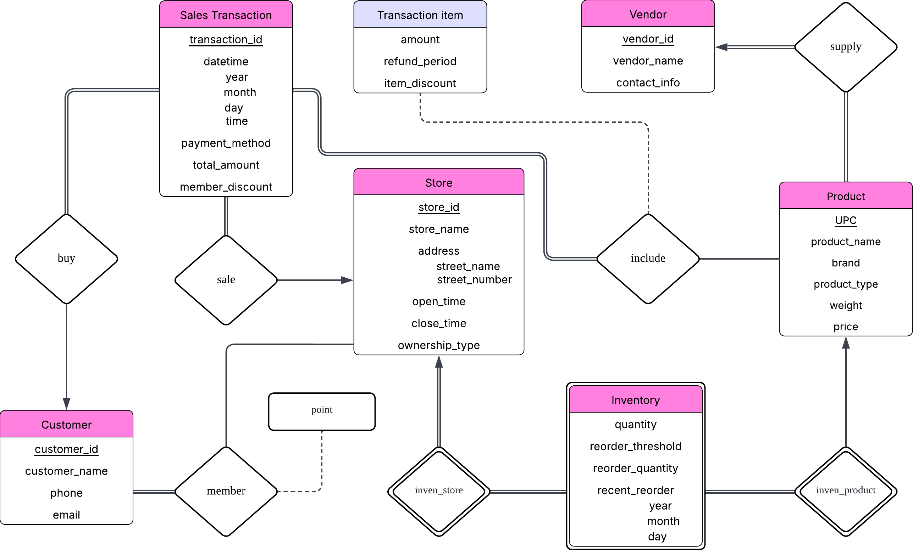

# CSE4110 Database Systems — Project 1: E-R Diagram Design

**Semester:** Spring 2025

## Project Overview

This project designs a **conceptual database schema for a convenience store chain** using the Entity-Relationship (E-R) model.

The goal is to model the major components of a convenience store supply and sales system—including stores, products, vendors, inventory, customers, and sales transactions—so that the required business queries can be answered conceptually from the schema.

This project focuses only on **conceptual database design**. No SQL implementation, relational schema creation, database population, or application code is required.

## E-R Diagram



The diagram was designed based on the project requirements and the following assumptions:

1. Each product is supplied by exactly one vendor.
2. Customer information is stored only for customers who register as members.
3. Non-member purchases may still occur, but such transactions are not linked to a `Customer` entity.
4. Unless explicitly stated otherwise, attributes are assumed to be mandatory.
5. `Customer.phone` and `Customer.email` are optional.
6. A customer may register at multiple stores, and membership points are managed separately for each store.
7. `Inventory` is modeled as a weak entity because an inventory record is meaningful only for a specific `(Store, Product)` pair.

---

## Entities

### Store

Represents a convenience store branch.

| Attribute | Description |
|---|---|
| `store_id` | Primary key that uniquely identifies a store |
| `store_name` | Store name |
| `address` | Composite attribute for the store address |
| `street_name` | Street name component of `address` |
| `street_number` | Street number component of `address` |
| `open_time` | Daily opening time |
| `close_time` | Daily closing time |
| `ownership_type` | Indicates whether the store is corporate-owned or franchise-owned |

For a 24-hour store, both `open_time` and `close_time` may be represented as `00:00`. The design assumes that each store follows the same daily opening and closing schedule throughout the year.

### Customer

Represents a customer who has registered as a member.

| Attribute | Description |
|---|---|
| `customer_id` | Primary key that uniquely identifies a member |
| `customer_name` | Customer name |
| `phone` | Optional phone number |
| `email` | Optional email address |

Only registered members are stored in the database. A customer may have at most one phone number in this model.

### Vendor

Represents a supplier that provides products to the convenience store chain.

| Attribute | Description |
|---|---|
| `vendor_id` | Primary key that uniquely identifies a vendor |
| `vendor_name` | Vendor name |
| `contact_info` | Vendor contact information |

Every vendor is assumed to provide at least one product.

### Product

Represents a product sold by the convenience store chain.

| Attribute | Description |
|---|---|
| `UPC` | Primary key used to uniquely identify a product |
| `product_name` | Product name |
| `brand` | Brand name |
| `product_type` | Product category/type |
| `weight` | Product weight or volume |
| `price` | Product price |

`product_type` is stored as a flat category rather than a hierarchical taxonomy. Product weight is assumed to use kilograms where applicable, and price is expressed in KRW.

### Inventory

Represents the inventory of a specific product at a specific store.

`Inventory` is modeled as a **weak entity** identified through its relationships with `Store` and `Product`.

| Attribute | Description |
|---|---|
| `quantity` | Current stock quantity |
| `reorder_threshold` | Inventory level at which restocking should be triggered |
| `reorder_quantity` | Quantity to order when restocking |
| `recent_reorder` | Most recent reorder date |
| `year` | Year component of `recent_reorder` |
| `month` | Month component of `recent_reorder` |
| `day` | Day component of `recent_reorder` |

An inventory record therefore represents the stock status of one product at one store.

### Sales Transaction

Represents a completed sales transaction.

| Attribute | Description |
|---|---|
| `transaction_id` | Primary key that uniquely identifies a transaction |
| `datetime` | Composite attribute representing transaction time |
| `year` | Year component of `datetime` |
| `month` | Month component of `datetime` |
| `day` | Day component of `datetime` |
| `time` | Time component of `datetime` |
| `payment_method` | Payment method, such as cash, card, or bank transfer |
| `total_amount` | Total transaction amount |
| `member_discount` | Discount amount paid using membership benefits/points |

`member_discount` is represented as a monetary amount rather than a percentage.

### Transaction Item

Represents the attributes of a product included in a particular sales transaction.

Because `Sales Transaction` and `Product` have an M:N relationship, `Transaction Item` stores relationship-specific information.

| Attribute | Description |
|---|---|
| `amount` | Quantity of the product sold in the transaction |
| `refund_period` | Refund period for the purchased item |
| `item_discount` | Discount applied to the item |

---

## Relationships and Cardinalities

### Supply — Vendor : Product = 1:N

A vendor may supply multiple products, while each product is supplied by exactly one vendor.

Both `Vendor` and `Product` have total participation in this relationship under the project assumptions:

- every product must have a vendor,
- every vendor must supply at least one product.

### Include — Sales Transaction : Product = M:N

A sales transaction may contain multiple products, and the same product may appear in many different transactions.

- `Sales Transaction`: total participation
- `Product`: partial participation

The relationship contains the `Transaction Item` attributes `amount`, `refund_period`, and `item_discount`.

### Sale — Store : Sales Transaction = 1:N

A store may generate many sales transactions, but each transaction occurs at exactly one store.

- `Sales Transaction`: total participation
- `Store`: partial participation

### Buy — Customer : Sales Transaction = 1:N

A registered customer may make multiple purchases, while a transaction may be associated with at most one registered customer.

Both sides have partial participation:

- a registered customer may have no purchase history,
- a transaction may be made by a non-member and therefore have no associated `Customer`.

### Member — Customer : Store = M:N

A customer may register at multiple stores, and a store may have multiple registered customers.

- `Customer`: total participation
- `Store`: partial participation

The relationship has a `point` attribute because the same customer may hold a different point balance at each store.

### Inven_store — Inventory : Store = M:1

Each inventory record belongs to exactly one store, while a store may maintain many inventory records.

`Inventory` is totally dependent on `Store` through this identifying relationship.

### Inven_product — Inventory : Product = M:1

Each inventory record refers to exactly one product, while a product may appear in inventory records for multiple stores.

`Inventory` is also dependent on `Product`, allowing an inventory record to be uniquely interpreted as the stock status of a particular product at a particular store.

---

## Support for Required Sample Queries

The E-R model was designed so that the sample queries in the project specification can be answered conceptually.

### 1. Product Availability

> Which stores currently carry a certain product, and how much inventory do they have?

`Store`, `Product`, and `Inventory` are connected so that a product can be located by its UPC, name, or brand, and the corresponding inventory quantity can be retrieved for each store.

### 2. Top-Selling Items

> Which products have the highest sales volume in each store over the past month?

For each store, recent `Sales Transaction` records can be filtered by `datetime`. The products included in those transactions can then be grouped through `Transaction Item`, and their `amount` values can be aggregated to determine the highest-selling products.

### 3. Store Performance

> Which store has generated the highest overall revenue this quarter?

`Sales Transaction` is linked directly to `Store`. Transactions can be filtered by quarter using `datetime`, and `total_amount` can be aggregated by store to compare revenue.

### 4. Vendor Statistics

> Which vendor supplies the most products across the chain, and how many total units have been sold?

The `Supply` relationship connects each vendor to its products. Those products can then be linked to `Transaction Item` records, allowing both the number of supplied products and the total sold quantity to be computed.

### 5. Inventory Reorder Alerts

> Which products in each store are below the reorder threshold and need restocking?

Each `Inventory` record stores both `quantity` and `reorder_threshold`. A product requires restocking when:

```text
quantity < reorder_threshold
```

Because every inventory record is associated with both a store and a product, the model can identify exactly which item requires restocking at which store.

### 6. Customer Purchase Patterns

> What are the top three items that loyalty-program customers typically purchase with coffee?

For member-linked transactions, `Customer` is connected to `Sales Transaction` through `Buy`. Transactions containing coffee can be identified through `Include`, and the quantities of the other products in the same transactions can be aggregated using `Transaction Item.amount`.

### 7. Franchise vs. Corporate Comparison

> Among franchise-owned stores, which store offers the widest variety of products, and how does that compare with corporate-owned stores?

Stores can first be grouped using `ownership_type`. The number of distinct products associated with each store can then be determined through `Inventory`, making it possible to compare product variety between franchise and corporate stores.

---

## Design Summary

The model separates relatively stable business objects such as `Store`, `Product`, `Vendor`, and `Customer` from operational data such as `Inventory` and `Sales Transaction`.

The two central associative structures are:

- `Inventory`, which represents the store-product stock relationship, and
- `Transaction Item`, which represents the transaction-product purchase relationship.

This design allows the E-R diagram to capture both the supply/inventory side and the sales/customer side of a convenience store chain while supporting the required sample queries through clearly defined entities, relationships, cardinalities, and participation constraints.
