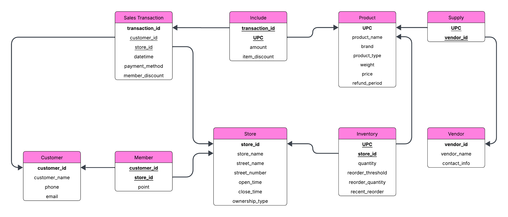
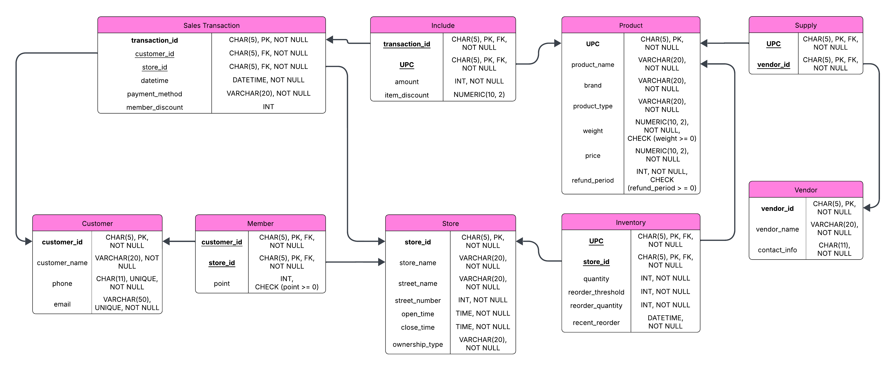

# CSE4110 Database Systems — Project 2

**Database Implementation and Application Development**  
**Semester:** Spring 2025  

## Overview

Project 2 extends the conceptual E-R design from Project 1 into a working relational database system.

The project covers the complete database development flow:

1. Reduce the E-R model into a relational schema.
2. Analyze functional dependencies and normalize the schema to BCNF.
3. Design a physical schema with MySQL data types and constraints.
4. Create and populate the database in MySQL.
5. Implement a menu-driven C++ application using the MySQL C API.
6. Execute the seven sample queries defined in Project 1.

The final implementation models customers, stores, products, vendors, inventory, membership, sales transactions, and product-level transaction records for a convenience-store chain.

---

## Schema Design

### Logical Schema



The E-R model from Project 1 was reduced using standard mapping rules:

- A **1:N relationship** is represented by placing the primary key of the `1` side as a foreign key on the `N` side.
- An **M:N relationship** is converted into a separate relation containing the primary keys of the participating relations.
- Relationship attributes are stored in the relation created for that relationship.
- A **weak entity** is identified using the primary keys of its owner entities.
- Composite attributes are reduced to atomic attributes.

For this project:

- `Buy` is represented by `customer_id` in `Sales_Transaction`.
- `Sale` is represented by `store_id` in `Sales_Transaction`.
- `Member` becomes a separate relation with `(customer_id, store_id)` as its composite key.
- `Include` becomes a separate relation connecting transactions and products.
- `Supply` becomes a separate relation connecting products and vendors.
- `Inventory` is represented by a relation identified by `(UPC, store_id)`.
- The composite `address` attribute is reduced into `street_name` and `street_number`.
- `datetime` and `recent_reorder` are stored as atomic `DATETIME` values in the physical implementation.

### Final Relations

| Relation | Primary Key | Important Foreign Keys |
|---|---|---|
| `Customer` | `customer_id` | — |
| `Store` | `store_id` | — |
| `Member` | (`customer_id`, `store_id`) | `customer_id → Customer`, `store_id → Store` |
| `Sales_Transaction` | `transaction_id` | `customer_id → Customer`, `store_id → Store` |
| `Product` | `UPC` | — |
| `Include` | (`transaction_id`, `UPC`) | `transaction_id → Sales_Transaction`, `UPC → Product` |
| `Inventory` | (`UPC`, `store_id`) | `UPC → Product`, `store_id → Store` |
| `Vendor` | `vendor_id` | — |
| `Supply` | (`UPC`, `vendor_id`) | `UPC → Product`, `vendor_id → Vendor` |

---

## BCNF Normalization

Functional dependencies were analyzed for every relation.

Most relations already satisfied BCNF because every non-trivial functional dependency was determined by a superkey. The important exception was the original `Include` relation:

```text
Include(
    transaction_id,
    UPC,
    amount,
    refund_period,
    item_discount
)
```

with the functional dependencies:

```text
(transaction_id, UPC) -> amount, refund_period, item_discount
UPC -> refund_period
```

`UPC -> refund_period` violates BCNF because `UPC` is not a superkey of `Include`.

The relation was therefore conceptually decomposed into:

```text
R1(transaction_id, UPC, amount, item_discount)
R2(UPC, refund_period)
```

Because `Product` already uses `UPC` as its primary key, a separate `R2` relation was unnecessary. Instead, `refund_period` was moved into `Product`.

The resulting relations used in the final logical schema satisfy BCNF.

---

## Physical Schema



The normalized logical schema was mapped to MySQL data types and constraints.

### Main Design Choices

- Fixed-length identifiers such as customer IDs, store IDs, transaction IDs, UPCs, and vendor IDs use `CHAR(5)`.
- Names and category values use `VARCHAR`.
- `DATETIME` is used for transaction timestamps and reorder timestamps.
- `TIME` is used for store opening and closing times.
- Monetary or decimal values such as product price, weight, and item discount use `NUMERIC(10, 2)`.
- Composite primary keys are used for `Member`, `Include`, `Inventory`, and `Supply`.
- Foreign-key constraints preserve referential integrity.
- `UNIQUE` constraints are applied to customer phone numbers and email addresses.
- `CHECK` constraints are used where non-negative values are required, such as membership points, product weight, and refund period.

The physical schema is implemented in [`schema.sql`](./database/schema.sql).

---

## Database Tables

### Customer

Stores registered customer information.

```text
Customer(
    customer_id,
    customer_name,
    phone,
    email
)
```

`customer_id` is the primary key. Phone numbers and email addresses are unique.

### Store

Stores convenience-store branch information.

```text
Store(
    store_id,
    store_name,
    street_name,
    street_number,
    open_time,
    close_time,
    ownership_type
)
```

`ownership_type` distinguishes franchise-owned and corporate-owned stores.

### Member

Represents store membership and store-specific reward points.

```text
Member(
    customer_id,
    store_id,
    point
)
```

The composite primary key is `(customer_id, store_id)`.

### Sales_Transaction

Stores transaction-level information.

```text
Sales_Transaction(
    transaction_id,
    customer_id,
    store_id,
    datetime,
    payment_method,
    member_discount
)
```

Each transaction references one customer and one store.

### Product

Stores product information.

```text
Product(
    UPC,
    product_name,
    brand,
    product_type,
    weight,
    price,
    refund_period
)
```

`refund_period` is stored in `Product` as a result of the BCNF normalization process.

### Include

Represents products included in individual transactions.

```text
Include(
    transaction_id,
    UPC,
    amount,
    item_discount
)
```

The composite primary key is `(transaction_id, UPC)`.

### Inventory

Stores the inventory status of each product at each store.

```text
Inventory(
    UPC,
    store_id,
    quantity,
    reorder_threshold,
    reorder_quantity,
    recent_reorder
)
```

The composite primary key `(UPC, store_id)` identifies the inventory state of a product at a specific store.

### Vendor

Stores supplier information.

```text
Vendor(
    vendor_id,
    vendor_name,
    contact_info
)
```

### Supply

Represents the relationship between products and vendors.

```text
Supply(
    UPC,
    vendor_id
)
```

The composite primary key is `(UPC, vendor_id)`.

---

## Sample Data

[`sample_data.sql`](./database/sample_data.sql) populates the schema with generated sample data covering multiple stores, customers, products, transactions, vendors, and inventory states.

The provided data set contains:

| Relation | Records |
|---|---:|
| `Customer` | 200 |
| `Store` | 100 |
| `Member` | 300 |
| `Sales_Transaction` | 200 |
| `Product` | 200 |
| `Include` | 200 |
| `Inventory` | 300 |
| `Vendor` | 50 |
| `Supply` | 200 |

The data maintains the foreign-key relationships required by the schema and includes both franchise and corporate stores so that all seven application queries can be exercised.

---

## C++ Application

The application in [`main.cpp`](./src/main.cpp) connects to the MySQL database using the **MySQL C API** and provides a menu-driven interface for executing the required queries.

The program consists mainly of three parts.

### `displayMenu()`

Prints the query menu and allows the user to choose query types `1` through `7` or terminate the application with `0`.

### `executeQuery()`

Executes a SQL statement through the MySQL connection and prints the returned result set.

The function performs the following steps:

```text
Execute query
    ↓
Store result
    ↓
Read field metadata
    ↓
Print column headers
    ↓
Print result rows
```

### `main()`

Initializes the MySQL connection, displays the menu repeatedly, builds the SQL query corresponding to the user's selection, and calls `executeQuery()`.

Selecting `0` terminates the loop and closes the database connection.

---

## Implemented Queries

The application implements all seven sample queries from Project 1.

| Type | Query |
|---:|---|
| **1** | Find stores carrying a product by UPC, product name, or brand and display their inventory levels. |
| **2** | Find the highest-selling product in each store over the past 30 days. |
| **3** | Find the store with the highest overall revenue in the current quarter. |
| **4** | Find the vendor supplying the largest number of distinct products and report the total units sold. |
| **5** | Find products whose inventory quantity is below the reorder threshold. |
| **6** | Find the top three products purchased together with a user-specified product type by loyalty-program customers. |
| **7** | Compare the store with the widest product variety among franchise stores with the corresponding corporate-owned store. |

### Query 1 — Product Availability

The user enters a product identifier such as a UPC, product name, or brand.

The query joins:

```text
Inventory
  ├── Store
  └── Product
```

and returns stores with positive inventory for the matching product.

### Query 2 — Top-Selling Items

The query aggregates `Include.amount` for transactions within the last 30 days, groups the result by store and product, and returns the product with the maximum sales volume in each store.

### Query 3 — Store Performance

Transactions in the current year and quarter are grouped by store. Revenue is calculated using:

```text
SUM(Product.price * Include.amount)
```

and the store with the highest value is returned.

### Query 4 — Vendor Statistics

`Vendor`, `Supply`, and `Include` are joined to determine:

- the number of distinct products supplied by each vendor, and
- the total number of supplied units that have been sold.

A `LEFT JOIN` is used with `Include` so that supplied products with no sales records are not removed from the vendor analysis.

### Query 5 — Inventory Reorder Alerts

A product is considered to require restocking when:

```text
quantity < reorder_threshold
```

The output includes both store and product information.

### Query 6 — Customer Purchase Patterns

The user enters a product type, such as `Coffee`.

The query first finds loyalty-member transactions containing the selected product type and then aggregates the other products purchased in the same transactions. The three products with the largest total quantity are returned.

### Query 7 — Franchise vs. Corporate Comparison

Two common table expressions independently find:

- the franchise store with the largest number of distinct inventory products, and
- the corporate store with the largest number of distinct inventory products.

The two results are displayed together for comparison.

---

## Development Environment

The submitted implementation was developed and tested in the following environment:

| Component | Environment |
|---|---|
| OS | Windows 11 |
| Database | MySQL 8.0.42 |
| Database Design Tool | MySQL Workbench |
| Language | C++ |
| Compiler | MSVC (`cl.exe`) |
| Editor | Visual Studio Code 1.101.0 |
| Database API | MySQL C API |
| Connector | MySQL Connector/C 6.1 |
| Shell | x64 Native Tools Command Prompt for VS 2022 |

> `main.cpp` includes `<mysql.h>`, so the MySQL Connector/C include and library directories must be available when compiling.

---

## Setup

### 1. Start MySQL

Start the local MySQL server.

The submitted `main.cpp` uses the following connection settings by default:

```cpp
const char *server = "localhost";
const char *user = "root";
const char *password = "1234";
const char *database = "store";
```

If your local MySQL configuration is different, edit these values before compiling.

### 2. Create the Database

Create a schema named `store` and select it as the active database.

For example:

```sql
CREATE DATABASE store;
USE store;
```

Then execute:

```text
schema.sql
sample_data.sql
```

in that order.

> `schema.sql` begins with `DROP TABLE` statements. On a clean database, if your SQL client stops because those tables do not yet exist, skip/comment out the initial drop statements and run the table-creation section.

### 3. Connector/C Authentication Compatibility

The submitted environment used MySQL Connector/C 6.1. If authentication compatibility is required for this older connector, connect to MySQL and configure the account accordingly.

For the coursework environment, the following form was used:

```sql
ALTER USER 'root'@'localhost'
IDENTIFIED WITH mysql_native_password BY '<your-password>';

FLUSH PRIVILEGES;
```

Use a password appropriate for your own local environment.

---

## Build

Open **x64 Native Tools Command Prompt for VS 2022**, move to the directory containing `main.cpp`, and compile with:

```bat
cl.exe /EHsc ^
  /I"C:\Program Files\MySQL\MySQL Connector C 6.1\include" ^
  main.cpp ^
  /link ^
  /LIBPATH:"C:\Program Files\MySQL\MySQL Connector C 6.1\lib" ^
  libmysql.lib
```

If MySQL Connector/C is installed at a different location, replace the include and library paths accordingly.

After a successful build, `main.exe` is generated.

---

## Run

Execute:

```bat
.\main.exe
```

The program displays:

```text
---------- SELECT QUERY TYPES ----------
1. TYPE 1
2. TYPE 2
3. TYPE 3
4. TYPE 4
5. TYPE 5
6. TYPE 6
7. TYPE 7
0. QUIT
```

Enter a number from `1` to `7` to execute a query.

Some query types request additional input:

- **Type 1:** product UPC, product name, or brand
- **Type 6:** product type, e.g. `Coffee`

Enter:

```text
0
```

to exit.

Values outside the supported menu range are handled with:

```text
Wrong Type
```

---

## Testing and Validation

The submitted implementation was manually validated using the generated sample database.

The project report verifies the following behaviors:

- Type 1 successfully searches products by UPC, product name, and brand.
- Type 2 returns the highest-volume product for stores with sales during the last 30 days.
- Type 3 returns the highest-revenue store for the current quarter.
- Type 4 returns vendor product-count and sales-volume information.
- Type 5 returns only inventory rows satisfying `quantity < reorder_threshold`.
- Type 6 returns the three most frequently purchased companion products for the selected product type among loyalty-member transactions.
- Type 7 returns the highest-variety franchise and corporate stores side by side.
- Input `0` terminates the application.
- Unsupported menu values produce the `Wrong Type` message.

Because the sample transactions are time-dependent, queries using the current date, month, or quarter may return different numbers of rows depending on when the program is executed and which sample data is loaded.

---

## Project Files

```text
.
├── logical_schema.png
├── physical_schema.png
├── project_report.pdf
├── schema.sql
├── sample_data.sql
├── main.cpp
└── README.md
```

| File | Description |
|---|---|
| `logical_schema.png` | Final normalized relational schema |
| `physical_schema.png` | Physical schema with MySQL types and constraints |
| `project_report.pdf` | Detailed design, normalization, implementation, and testing report |
| `schema.sql` | MySQL table definitions and integrity constraints |
| `sample_data.sql` | Sample records used to populate and test the database |
| `main.cpp` | Menu-driven MySQL C API application |
| `README.md` | Setup, build, usage, and project documentation |

---

## Notes

This repository is a course project intended to demonstrate relational-schema design, BCNF normalization, MySQL implementation, and database application development.

The connection credentials in `main.cpp` are coursework defaults for the submitted local environment. They should be changed or externalized before using the program outside that environment.
